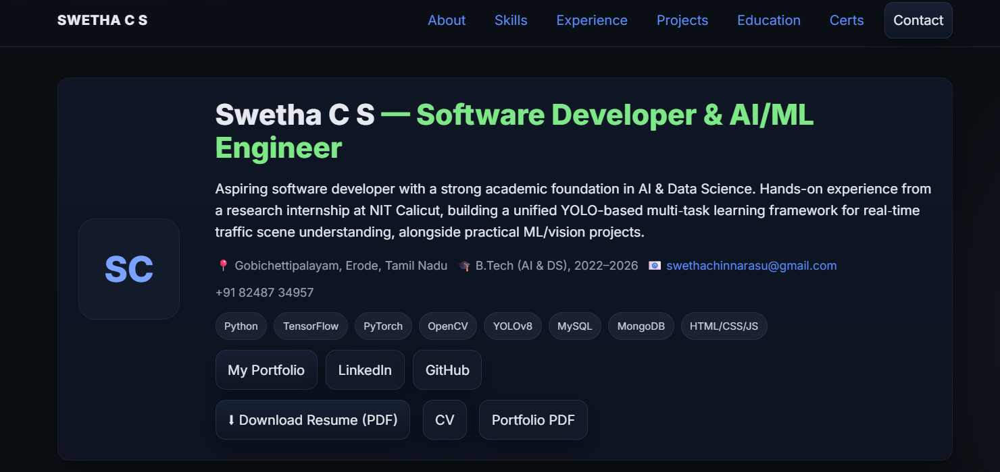

# 🌐 Swetha C S — Software Developer & AI/ML Engineer Portfolio  

  
  
  

  

This repository contains my **personal portfolio website**, showcasing my journey as a **Software Developer & AI/ML Engineer**.  
It includes details of my **skills, projects, education, certifications, and experience**.  

---

## 🔗 Live Portfolio  
👉 [**View My Portfolio**](https://swethacs.my.canva.site/)  

---

## 📌 Sections  

- **About Me** – Short bio, role, and key strengths  
- **Skills** – Programming, AI/ML, Databases, Web, Blockchain, Tools, XR, Soft Skills  
- **Experience** – Research Internship at NIT Calicut, ML & Python Internships  
- **Projects** – YOLO-MTS, SCANLITE, Age Detection with OpenCV  
- **Education** – B.Tech AI & DS at PACET (CGPA 8.92/10)  
- **Certifications & Activities** – Courses, Workshops, Positions, Achievements  
- **Contact** – Email, LinkedIn, GitHub, Phone  

---

## 🛠️ Tech Stack  

- **Languages**: Python, Java, C  
- **AI/ML**: TensorFlow, PyTorch, Keras, OpenCV, CNNs, Deep Learning  
- **Databases**: MySQL, MongoDB  
- **Web**: HTML, CSS, JavaScript  
- **Blockchain**: Ethereum, Hyperledger, Smart Contracts  
- **Tools/Platforms**: Git, GitHub, VS Code, Google Colab  
- **XR / Game Dev**: Unity, AR, VR  
- **Soft Skills**: Problem Solving, Team Collaboration, Communication, Research  

---

## 🚀 Projects  

### YOLO-MTS: Unified Multi-Task Learning for Traffic Scene Understanding  
- Integrated detection, segmentation, instance counting & traffic state classification using YOLOv8 shared backbone.  
- Optimized for real-time deployment (~30 FPS).  

### SCANLITE — Lightweight Windows Vulnerability Scanner  
- Python-based scanner to detect misconfigurations & missing patches.  
- Generates automated **HTML reports** for easy sharing.  

### Age Detection Using OpenCV  
- AI system to estimate human age from facial features in images & video.  
- Uses CNNs + OpenCV for **real-time inference**.  

---

## 🎓 Education  

- **B.Tech — Artificial Intelligence & Data Science**  
  P.A. College of Engineering and Technology (2022–2026)  
  - CGPA: **8.92 / 10**  
  - Coursework: OS, DBMS, ML, DL, Security, NLP, GenAI, Big Data, Visualization  

---

## 📬 Contact  

- **Email:** swethachinnarasu@gmail.com  
- **Phone:** [+91 82487 34957](tel:+918248734957)  
- **LinkedIn:** [linkedin.com/in/swetha-cs-29668a30a](https://linkedin.com/in/swetha-cs-29668a30a)  
- **GitHub:** [github.com/csswetha12](https://github.com/csswetha12)  
- **Facebook:** [facebook.com/profile.php?id=100089578663517](https://www.facebook.com/profile.php?id=100089578663517)  

---

⭐ If you like this portfolio, don’t forget to **star this repo**!

